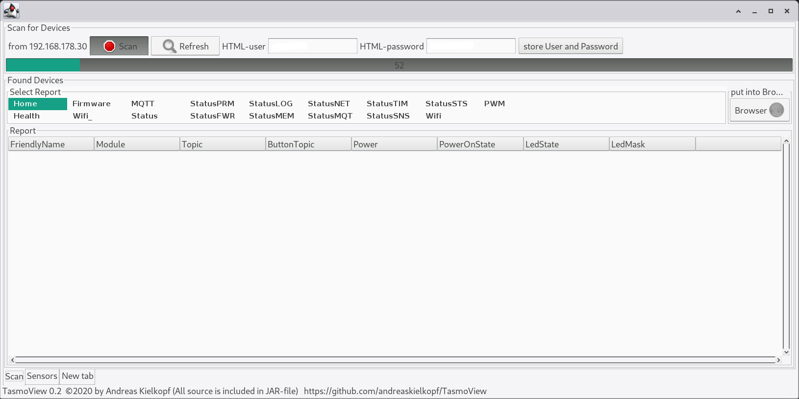
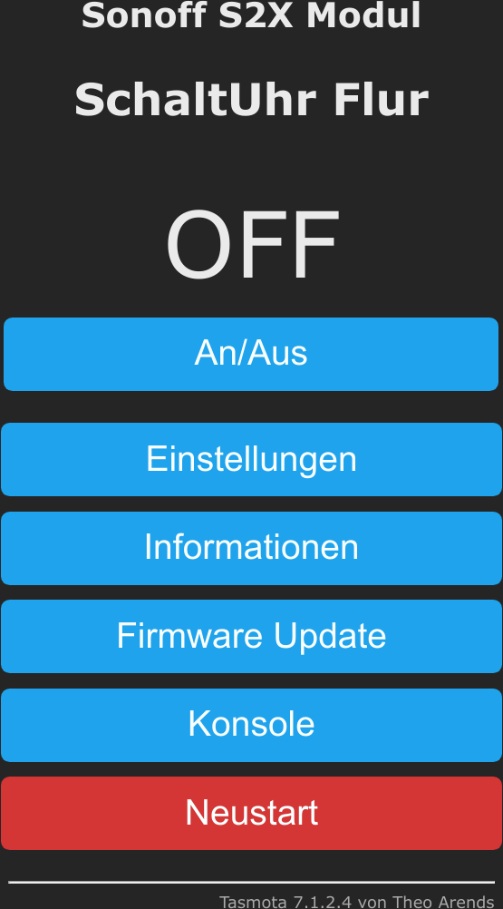
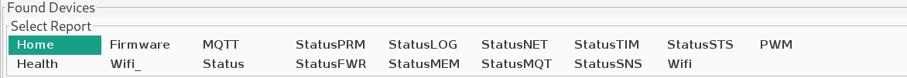
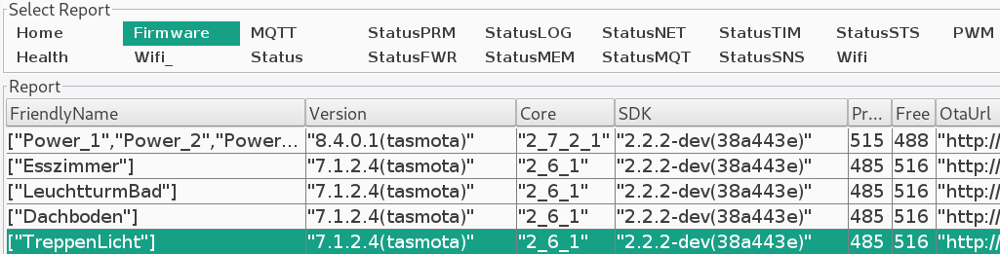
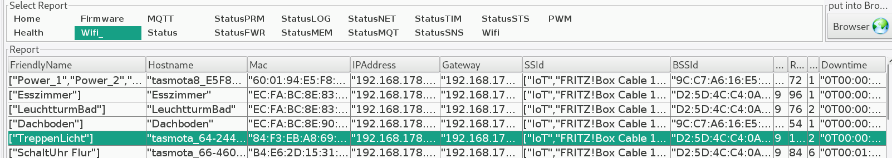
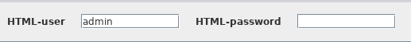
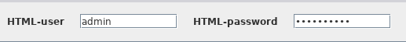
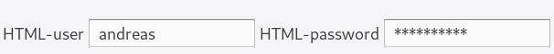

##### [Englisch](./README.md)

# TasmoView 0.4
Da ich einige [Tasmota-Geräte](https://tasmota.github.io/docs/#/Home) benutze, musste ich oft nach der entsprechenden IP-Adressen in meinem Netzwerk suchen. Dann habe ich TasmoManager gefunden. Das funktionierte sehr gut, aber ich musste einen MQTT-Server einrichten und jedes Gerät für die Verwendung von mqtt konfigurieren ...

Um es mir (und meiner Frau) einfacher zu machen, habe ich ein kleines Programm in meiner bevorzugten Programmiersprache java geschrieben. Dieses Programm sucht Tasmota Geräte im lokalen Netzwerk per HTTP. Dies kann eventuell auch für andere nützlich sein, so dass ich dieses kleine Programm hier veröffentliche.

Das Programm ist bis heute nur in meinem lokalen Netzwerk und mit Linux (manjaro) als Betriebssystem getestet. Aber es sollte überall laufen wenn Sie zumindest **Java 8 installiert** haben. (Tester mit anderer Konfiguration sind willkommen)

Das Programm wird als JAR-Datei mit enthaltenen Quelltexten zur Verfügung gestellt. Dies bedeutet, dass alle (!) Quelldateien in dieser einen Jar-Datei enthalten sind. Trotzdem ist die JAR-Datei direkt ausführbar. (**java -jar TasmoView.jar**)

### siehe auch: [Tasmota](https://tasmota.github.io/docs/#/Home "Project Tasmota Webpage") https://tasmota.github.io/docs/#/Home
Tasmota ist eine Open Source Firmware für ESP8266 Geräte
* Vollständige lokale Kontrolle mit schneller Einrichtung und Aktualisierung
* Steuerung über MQTT, Web UI, **HTTP** oder seriell
* Automatisieren Sie mit Timern, Regeln oder Skripten
* Integration mit Hausautomationslösungen
* Unglaublich erweiterbar und flexibel

#### Vorraussetzungen:
Sie können testen, ob sie bereits eine passende Java-Version auf ihrem Computer installiert haben:
> java --version

> ergibt bei mir: openjdk 11.0.8 2020-07-14

Wenn die Antwort **größer als Java 8 (1.8)** ist können Sie den folgenden Abschnitt überspringen. Ansonsten müssen Sie zuerst eine aktuelle Version von Java installieren. Die Java-Version 8 ist ausreichend, aber sie können auch problemlos Java 11 oder Java 13 installieren.

##### empfohlen: Java 8, 11 oder 13
* [OpenJDK](https://openjdk.java.net/install/,"https://openjdk.java.net/install/") https://openjdk.java.net/install/
* [OpenJDK Java SE 13](https://jdk.java.net/13/) https://jdk.java.net/13/
* [OpenJDK Java SE 11](https://jdk.java.net/archive/) https://jdk.java.net/archive/
* [OpenJDK Java SE 8](https://jdk.java.net/java-se-ri/8-MR3,"https://jdk.java.net/java-se-ri/8-MR3") https://jdk.java.net/java-se-ri/8-MR3
* [Oracle java SE 13](https://www.oracle.com/technetwork/java/javase/downloads/index.html) https://www.oracle.com/technetwork/java/javase/downloads/index.html
* [Oracle Java SE8](https://www.java.com/de/download/,"https://www.java.com/de/download/") https://www.java.com/de/download/
	
### Download:
Laden Sie die Datei [TasmoView.jar](https://github.com/andreaskielkopf/TasmoView/blob/master/TasmoView.jar "Download des Programms TasmoView") auf ihren Computer

### Installieren:
Legen Sie die Datei TasmoView.jar an eine für Sie praktische Stelle im Dateisystem ihres Computers. Je nach Betriebssystem können Sie auch eine Startdatei auf ihrem Desktop anlegen mit der Sie TasmoView dann per Mausklick starten können

### Programmstart:
Wenn sie TasmoView.jar im aktuellen Verzeichniss abgelegt haben, starten Sie das Programm durch eingabe von
> **java -jar TasmoView.jar**

oder je nachdem wo Sie TasmoView.jar abgelegt haben, mit **java -jar /usr/local/bin/TasmoView.jar**
oder **java -jar C:/Benutzer/Meinpfad/TasmoView.jar** ...

## Benutzung:
Wenn das Programm startet, erscheint das Programmfenster und TasmoView beginnt im lokalen Netzwerk nach Geräten mit Tasmota Firmware zu suchen. Der Fortschrittsbalken wandert langsam von links nach rechts und im Fortschrittsbalken wird jeweils angezeigt nach welcher IP gesucht wird. Der Scanvorgang kann einige Minuten andauern.

Wenn Sie schon aktive Tasmota Geräte im Netzwerk haben, sollten diese im unteren Teil des Fensters aufgelistet werden sobald sie gefunden wurden. 

* Eines der gefundenen Geräte auswählen und danach den Knopf Browser anklicken. Jetzt sollte dei Weboberfläche des Gerätes in Ihrem Browser erscheinen. Hier können Sie ALLE Einstellungen des jeweiligen Gerätes bearbeiten und das Gerät vollumfänglich steuern.

## Erweiterungen:
Die aktuelle Version von TasmoView hat folgende erweiterte Möglichkeiten:
* Tabellarische Anzeige der Konfiguration der Geräte
* Suche nach passwortgeschützten Tasmota Geräten
* Zyklisches Auslesen der Sensoren solange TasmoView aktiv ist
* Anzeige des Verlaufs von Sensorwerten in einer einfachen Grafik

### Tabelarische Anzeige der Daten
im Bereich "Select Report" kann ausgewählt werden, welche Daten des Gerätes angezeigt werden sollen. Diese Daten werden beim Scan erhoben und werden nicht aktualisiert. 

Die angezeigten Daten werden direkt aus der JSON-Antwort der Geräte entnommen und sind somit von der jeweiligen Tasmota-Version abhängig.

Einige Daten erscheinen dadurch auch mehrfach in den Tabellen. Das Programm versucht die Breite der Spalten passend zum Inhalt einzustellen. Das gelingt aber nicht immer perfekt. Sie können die Breite der Spalten aber auch mit der Maus anpassen. Diese Anpassungen werden nicht gespeichert.

### Suche nach passwortgeschützten Geräten
Die Weboberfläche der Tasmota Geräte kann mit Benutzername und Passwort geschützt werden. Normalerweise ist der **Benutzername "admin"** und das **Passwort ist leer**. 

Sie können jedoch beides im Quelltext oder in der Benutzeroberfläche der Tasmota Geräte ändern. 

Damit TasmoView dann solche Geräte weiterhin auslesen kann, muss es im Besitz von Benutzername und Passwort sein. Es werden beim Scan jeweils nur die Geräte gefunden, für die der Benutzername und das Passwort passen.

