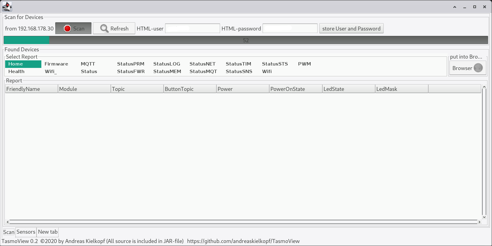
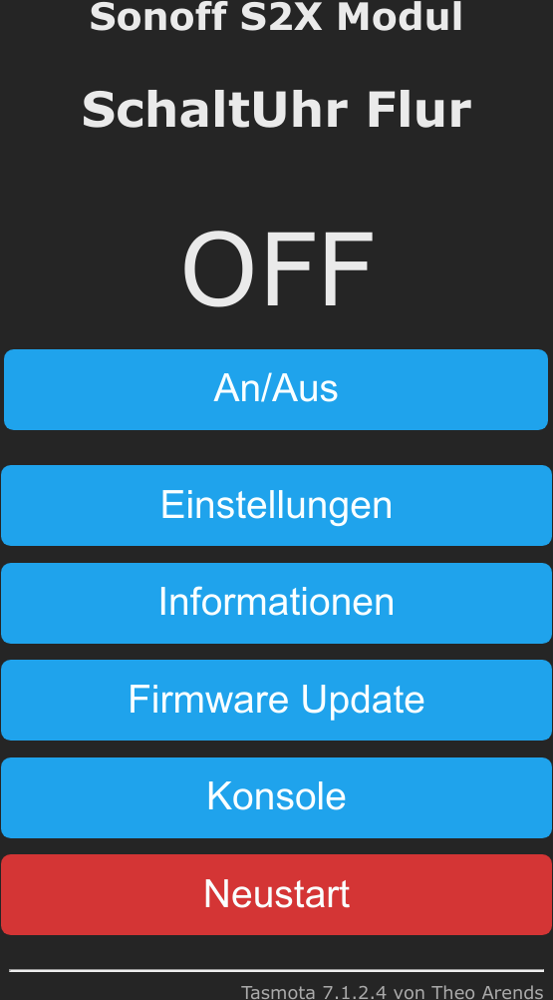
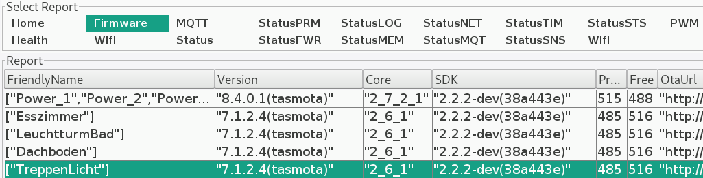
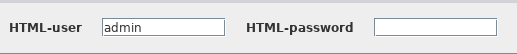

##### [Deutsch](./LIESMICH.md)

# TasmoView 0.4

Since I use some [Tasmota devices](https://tasmota.github.io/docs/#/Home), I often had to look for the corresponding IP addresses on my network. Then I found TasmoManager. This worked very well, but I had to set up an MQTT server and configure each device to use mqtt ...

To make things easier for me (and my wife), I wrote a small program in my favorite programming language, java. This program searches for Tasmota devices in the local network via HTTP. This may also be useful for others, so I am going to publish this little program here.

To date, the program has only been tested in my local network and with Linux (manjaro) as the operating system. But it should work anywhere if you have at least ** Java 8 installed **. (Testers with a different configuration are welcome)

The program is made available as a JAR file with the sourcecode included. This means that all (!) Source files are contained in this one jar file. Nevertheless, the JAR file can be executed directly. (** java -jar TasmoView.jar **)

### see: [Tasmota](https://tasmota.github.io/docs/#/Home "Project Tasmota Webpage") https://tasmota.github.io/docs/#/Home

Tasmota is an open source firmware for ESP8266 devices
* Total local control with quick setup and updates
* Control using MQTT, Web UI, **HTTP** or serial
* Automate using timers, rules or scripts
* Integration with home automation solutions
* Incredibly expandable and flexible

#### Requirements:

You can test whether you have already installed a suitable Java version on your computer:
> java --version

> gives at my pc: openjdk 11.0.8 2020-07-14

If the answer is ** greater than Java 8 (1.8) ** you can skip the following section. Otherwise you have to install a current version of Java first. Java version 8 is sufficient, but you can also install Java 11 or Java 13 without any problems.

##### recommended: Java 8, 11 or 13
* [OpenJDK](https://openjdk.java.net/install/,"https://openjdk.java.net/install/") https://openjdk.java.net/install/
* [OpenJDK Java SE 13](https://jdk.java.net/13/) https://jdk.java.net/13/
* [OpenJDK Java SE 11](https://jdk.java.net/archive/) https://jdk.java.net/archive/
* [OpenJDK Java SE 8](https://jdk.java.net/java-se-ri/8-MR3,"https://jdk.java.net/java-se-ri/8-MR3") https://jdk.java.net/java-se-ri/8-MR3
* [Oracle java SE 13](https://www.oracle.com/technetwork/java/javase/downloads/index.html) https://www.oracle.com/technetwork/java/javase/downloads/index.html
* [Oracle Java SE8](https://www.java.com/de/download/,"https://www.java.com/de/download/") https://www.java.com/de/download/

### Download:
Download the file [TasmoView.jar] (https://github.com/andreaskielkopf/TasmoView/blob/master/TasmoView.jar "Download of the TasmoView program") to your computer

### Install:
Place the TasmoView.jar file in a convenient place in your computer's file system. Depending on the operating system, you can also create a start file on your desktop with which you can then start TasmoView with a click of the mouse

### Start:
When you have saved TasmoView.jar in the current directory, start the program by entering
> ** java -jar TasmoView.jar **

or depending on where you have stored TasmoView.jar, with ** java -jar /usr/local/bin/TasmoView.jar**
or ** java -jar C: /User/Mypath/TasmoView.jar** ...

## Usage:
When the program starts, the program window appears and TasmoView begins to search for devices with Tasmota firmware in the local network. The progress bar moves slowly from left to right and the progress bar shows which IP is being searched for. The scanning process can take a few minutes.

If you already have active Tasmota devices in the network, they should be listed in the lower part of the window as soon as they are found.

* Select one of the devices found, then click the Browser button. The device's web interface should now appear in your browser. Here you can edit ALL the settings of the respective device and fully control the device.

## Extensions:
The current version of TasmoView has the following extended options:
* Tabular display of the configuration of the devices
* Search for password protected Tasmota devices
* Cyclical reading of the sensors as long as TasmoView is active
* Display of the history of sensor values ​​in a simple graphic

### Tabular display of data
In the "Select Report" area, you can select which device data should be displayed. These data are collected during the scan and are not updated.

The displayed data is taken directly from the JSON response of the devices and is therefore dependent on the respective Tasmota version.

As a result, some data may appear multiple times in the tables. The program tries to adjust the width of the columns to match the content. But that doesn't always work perfectly. You can also use the mouse to adjust the width of the columns. These adjustments are not saved.

### Search for password protected devices
The web interface of the Tasmota devices can be protected with a user name and password. Usually the ** username is "admin" ** and the ** password is blank **.

However, you may change one or both in the source code or in the user interface of the Tasmota devices.

In order for TasmoView to continue reading such devices, it must know the username and password. During the scan, only those devices will be found for which the username and password match.

