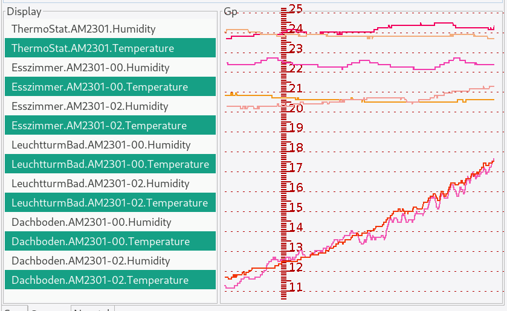
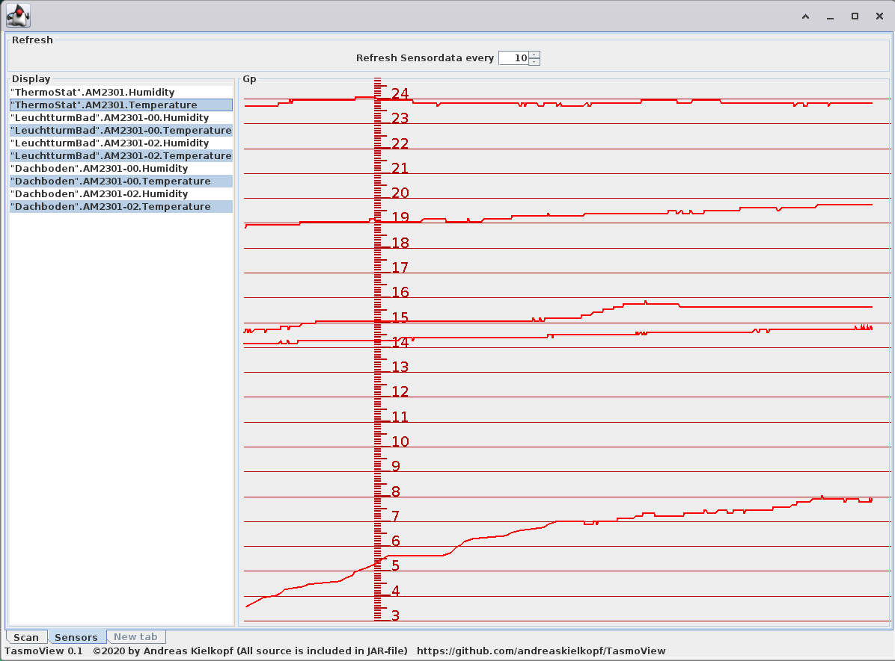

- [ ] FIXME: Versatz zwischen Raster und Wertegraph
- [ ] senkrechte Linien im Diagramm um den zeitlichen Verlauf einordnen zu können
- [ ] Jeder Sensor bekommt einen Spitznamen (speichern)
- [ ] Die Farbe der Messskalen werden einstellbar
- [ ] Die Farben der Sensoren werden einstellbar
- [ ] weitere Sensortypen :thinking: auf Antrag
- [ ] laden von früheren Messungen
- [ ] Einstellbare Zeitskala
- [ ] Automatik für die Abfragerate bei schnellen Änderungen je Gerät
- [ ] Vergleich historischer Messungen
- [ ] Täglich selbe Zeit
- [ ] Wöchentlich
- [ ] Mondphasen
- [ ] jährlich
- [ ] Täglich nach Sonnenaufgang/Sonnenuntergang
- [ ] X/Y-Graph mit 2 Sensoren Temperatur/Feuchte
- [ ] Graph mit Formel von 2 Messwerten
- [ ] 
- [ ] 
- [ ] 
- [ ] **ihr Vorschlag kann als Pull-Request hier eingefügt werden**

- [ ] FIXME: offset between grid and value graph
- [ ] vertical lines in the diagram to be able to classify the course over time
- [ ] Each sensor gets a nickname (save)
- [ ] The color of the measuring scales can be set
- [ ] The colors of the sensors are adjustable
- [ ] other sensor types: thinking: on request
- [ ] load previous measurements
- [ ] Adjustable time scale
- [ ] Automatic for the query rate for quick changes per device
- [ ] Comparison of historical measurements
- [ ] Same time every day
- [ ] Weekly
- [ ] phases of the moon
- [ ] annually
- [ ] Daily after sunrise / sunset
- [ ] X / Y graph with 2 temperature / humidity sensors
- [ ] Graph with a formula of 2 measured values
- [ ]
- [ ]
- [ ]
- [ ] ** Your suggestion can be inserted here as a pull request **

# Version 0.5

- [x] speichern IP der gefundenen Tasmotas und schnellsuche
- [x] Reiter "Power" hinzugefügt
- [x] Modultyp mit Namen in Tabelle anzeigen
- [x] Timer1..4 in Tabelle anzeigen
- [x] Rule1 in Tabelle anzeigen
- [x] template in Tabelle anzeigen
- [x] genutzte GPIOs in Tabelle anzeigen
- [x] Tabellenspalten sortiert nach Überschrift
- [x] "state" in Tabelle anzeigen
- [x] update der Tabelle bei Refresh
  

----
# Version 0.4

- [x] speichern der komprimierten Messungen
- [x] Die Farben der Sensordaten werden unterschiedlich (rötlich oder bläulich)
- [x] kompatibel mit Tasmota 8.4

 

- [x] save the compressed measurements
- [x] The colors of the sensor data are different (reddish or bluish)
- [x] compatible with Tasmota 8.4

----
# Version 0.3
- [x] Erweitern auf 10000 Messungen
- [x] Werte beim erfassen mit dem richtigen Zeitpunkt vom Sensor übernehmen
- [x] Gestrichelte Linien für das Raster
- [x] generate classfiles for java 8
- [x] FIXME: concurrent modifcation of Arraylists in Raster
- [X] Doppelte Werte bereits beim Erfassen droppen
- [X] FIXME: Raster zu eng bei Negativen Messwerten
- [X] FIXME: Modifikation der Messwertskala synchronisieren während Paintevent 
- [X] Beim komprimieren der Werte Mittelwert bilden 

- [x] Expand to 10000 measurements
- [x] Take over values ​​from the sensor at the correct time when recording
- [x] Dashed lines for the grid
- [x] generate class files for java 8
- [x] FIXME: concurrent modification of array lists in raster
- [X] Duplicate values ​​drop when they are entered
- [X] FIXME: Grid too narrow for negative measured values
- [X] FIXME: Modification of the measured value scale synchronize during Paintevent
- [X] Calculate the mean value when compressing the values

----
# Version 0.2
- [x] Speichern des Tasmota-username und password in der lokalen java-Registry (auf Wunsch)
- [x] Reiter für die Beobachtung von Sensoren mit regelmässiger Abfrage des Sensorstatus
- [x] Einstellbare Abfragerate für alle Sensoren gemeinsam
- [x] Auswahlliste zur Anzeige der Sensoren folgender Typen
- [x] AM2301 Temperatur rot
- [x] AM2301 Luftfeuchte blau
- [x] grafisches Diagramm mit dem fortlaufenden zeitlichen Verlauf der Sensordaten
- [x] waagerechte Linien im Diagramm um die Werte besser beurteilen zu können
- [x] Skalen für die verschiedenen Typen der Messwerte
- [x] Überblenden der Messwerttypen mit eigenem Faktor
- [x] Automatisches löschen von "unnötigen" Messwerten
- [x] Automatisches reduzieren der Daten auf 1000 Messungen je Sensor

 
 
- [x] save Tasmota-username and password in the local java registry (on request)
- [x] tab for the observation of sensors with regular query of the sensor status
- [x] Adjustable query rate for all sensors together
- [x] Selection list for displaying the sensors of the following types
- [x] AM2301 temperature red
- [x] AM2301 humidity blue
- [x] graphic diagram with the continuous temporal course of the sensor data
- [x] horizontal lines in the diagram to better assess the values
- [x] scales for the different types of measured values
- [x] Crossfading of the measured value types with their own factor
- [x] Automatic deletion of "unnecessary" measured values
- [x] Automatic reduction of the data to 1000 measurements per sensor

----
# Version 0.1
* Das Programm sucht im lokalen Netzwerk aktiv nach Tasmota-Geräten indem es diese per http anspricht [Scan]
* Der Scan kann wiederholt werden, wenn ein Gerät neu eingesteckt wurde
* Als username ist "admin" voreingestellt [user]
* Wenn die Geräte mit Passwort gesichert sind, kann das Passwort eingegeben werden [password]
* Passwort und Username werden dann für den Scan und den Refresh aller Geräte genutzt
* Alle gefundenen Geräte werden in einer Tabelle angezeigt 
* Der Status der Geräte wird abgefragt und in einer Reihe von Tabellenansichten dargestellt
* Der Status aller Geräte kann aktualisiert werden [Refresh]
* Wird ein Gerät in der Tabelle markiert, so kann mit einem Knopfdruck [Browser] die URL dieses Gerätes an den Browser geschickt werden, so dass der Browser die HTML-Seite des Gerätes darstellt
* Im Browser kann das Gerät dann gesteuert und konfiguriert werden
* Jedes Tasmota-Gerät das über den Browser erreichbar ist wird auch gefunden
* getestet mit Tasmota 7.1.2.4

* The program actively searches for Tasmota devices in the local network by addressing them via http [Scan]
* The scan can be repeated if a device is newly inserted
* "admin" is preset as username [user]
* If the devices are secured with a password, the password can be entered [password]
* Password and username are then used for the scan and refresh of all devices
* All devices found are displayed in a table
* The status of the devices is queried and shown in a series of table views
* The status of all devices can be updated [Refresh]
* If a device is marked in the table, the URL of this device can be sent to the browser at the push of a button [Browser], so that the browser displays the HTML page of the device
* The device can then be controlled and configured in the browser
* Every Tasmota device that can be reached via the browser is also found
* tested with Tasmota 7.1.2.4
----